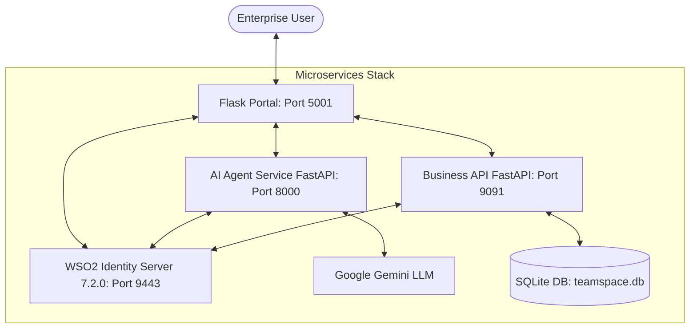
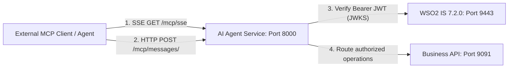

# Teamspace 🚀

> **Enterprise B2B CIAM & Agentic AI Identity Demonstration Portal**
>
> A demonstration application highlighting **WSO2 Identity Server 7.2.0**'s advanced B2B CIAM (Customer Identity & Access Management) capabilities blended with **Agentic AI Identity (On-Behalf-Of Delegation)** workflows.

---

## 📖 Overview

**Teamspace** is a B2B collaboration and meeting management portal built for modern enterprise teams. It serves as a live demonstration blueprint targeting CTOs, enterprise architects, and identity professionals.

The application demonstrates two core paradigms in modern enterprise software:
1. **B2B CIAM**: Dynamic tenant/sub-organization onboarding, cross-organization application sharing, delegated administration, role management, federated login via an external Identity Provider, and personalized sub-tenant branding (via the WSO2 IS Branding Preference API).
2. **Agentic AI & Identity**: A smart assistant (**Worklink Assistant**) powered by **Google Gemini** that can act securely *on behalf of* users via the **OAuth 2.0 Token Exchange (RFC 8693)** protocol, verifying and executing authorized corporate tasks (e.g., booking meetings) without possessing long-lived static credentials or full-access master keys.

The portal UI is bilingual (English / Portuguese), switchable at runtime via the `/set_lang` route; translation strings live under `webapp/translations/`.

---

## 🏗️ Architecture & Component Topology

The system is designed as a set of decoupled services interacting with a central identity provider.



### 📦 Components

1. **`webapp/` (Flask User Portal — Port `5001`)**:
   - The primary B2B portal interface, built with Flask blueprints (`main`, `dashboard`, `admin`, `personalization`, `signup`, `subscription`, `chat`, `agents`) and vanilla CSS.
   - Leverages OpenID Connect (OIDC) via WSO2 IS (using Authlib) to handle user authentication, enterprise SSO, and permission checks.
   - Implements **Sub-Organization Branding Preferences**: reads and updates organization-specific styles (primary/secondary colors, logos, banners) dynamically using the WSO2 IS Organization Branding APIs.
   - Entry point: `webapp.app:create_app` (application factory).

2. **`api/` (FastAPI Business API — Port `9091`)**:
   - The core business backend. Persists meetings, agent configurations, and organization data to a local SQLite database (`teamspace.db`) via SQLAlchemy.
   - Restricts operations using fine-grained OAuth 2.0 scopes (`list_meetings`, `create_meeting`, `update_meeting`, `delete_meeting`, etc.).
   - Validates JWT tokens issued by WSO2 IS, including checking for nested actor claims (`act`) in On-Behalf-Of scenarios.
   - Routers are mounted under `/meetings`, `/personalization`, `/agent-config`, and `/plans`. Entry point: `api.main:app`.

3. **`agent/` (AI Agent Service — Port `8000`)**:
   - The intelligent core utilizing the **Google Gemini API** (model `gemini-flash-latest`, via the `google-genai` SDK).
   - Acts as the **Worklink Assistant** which schedules and manages meetings on behalf of authorized corporate users.
   - Orchestrates the **OAuth 2.0 On-Behalf-Of (OBO) flow**: builds the WSO2 authorization URL, exchanges the returned authorization code for an OBO access token via RFC 8693 token exchange, and uses that delegated token to call the Business API.
   - Also hosts the **MCP server** (see below). Entry point: `agent.main:app`.

4. **`common/` (Shared library)**:
   - Centralised config defaults and one-shot `.env` loading (`common/config.py`), shared constants (`common/constants.py`), FastAPI error handlers, and a credential-masking log helper.

5. **`tests/` (Test Harness & E2E Suite)**:
   - A testing suite divided into `unit/`, `integration/`, and `e2e/` levels.
   - Features a **Programmatic Lifecycle Orchestrator** (`tests/conftest.py`) which manages ports, spins up dynamic, isolated clones of WSO2 IS inside a temporary folder, bootstraps the servers, configures credentials, and executes headless Playwright E2E flows before clean teardown.

---

## 🔒 The Agentic AI "On-Behalf-Of" (OBO) Flow

Traditional AI integrations require copying a static API key or granting the AI agent master administrator credentials. In high-security enterprise environments, this approach is unacceptable.

**Teamspace** implements the **RFC 8693 OAuth 2.0 Token Exchange** standard to establish narrow-scoped, time-bound, and fully auditable delegation:

```
┌──────┐             ┌──────────┐             ┌─────────────┐             ┌─────────┐
│ User │             │ AI Agent │             │  WSO2 IS    │             │ Biz API │
└──┬───┘             └────┬─────┘             └──────┬──────┘             └────┬────┘
   │                      │                          │                         │
   │ 1. "Schedule meeting"│                          │                         │
   ├─────────────────────>│                          │                         │
   │                      │ 2. Check OBO Token       │                         │
   │                      ├──┐                       │                         │
   │                      │  │ (None exists/expired) │                         │
   │                      │<─┘                       │                         │
   │ 3. Consent URL       │                          │                         │
   │<─────────────────────┤                          │                         │
   │                      │                          │                         │
   │ 4. Authenticate & Consent                       │                         │
   ├────────────────────────────────────────────────>│                         │
   │                      │                          │                         │
   │                      │ 5. Auth Code / User Token│                         │
   │                      │<─────────────────────────┤                         │
   │                      │                          │                         │
   │                      │ 6. Exchange for OBO Token│                         │
   │                      ├─────────────────────────>│                         │
   │                      │  (RFC 8693 token exchange)                         │
   │                      │                          │                         │
   │                      │ 7. OBO JWT Token Issued  │                         │
   │                      │<─────────────────────────┤                         │
   │                      │                          │                         │
   │                      │ 8. Create Meeting (with OBO Token)                 │
   │                      ├───────────────────────────────────────────────────>│
   │                      │                          │                         │ (Authorized!)
   │                      │                          │                         │<───────────
```

### Decoded OBO Token Structure

The resulting OBO access token is a JSON Web Token (JWT) that asserts a dual-identity representation. This enables the Business API to verify both *who* the executing agent is, and *on whose behalf* it is performing the action:

```json
{
  "sub": "d54ac2dc-7cad-4842-bcce-7905da589f17", 
  "act": {
    "sub": "814889a0-7730-4928-a3b6-b3cfd776262f"
  },
  "aud": "fLHf61QVhvGKJwOhM3NvekepG1Aa",
  "aut": "APPLICATION_USER",
  "client_id": "fLHf61QVhvGKJwOhM3NvekepG1Aa",
  "iss": "https://localhost:9443/t/teamspace/oauth2/token",
  "org_handle": "numbainfinite",
  "org_id": "848d1d37-2bac-4fad-98bd-eed28bacf173",
  "scope": "create_meeting list_meetings openid profile",
  "exp": 1779330751
}
```

- **`sub`**: The User ID (the resource owner who delegated the authority).
- **`act`** (Actor Claim): The Agent ID (the SCIM agent client executing the request).
- **`org_handle`**: The B2B tenant organization domain identifier, ensuring strict data tenancy separation.

---

## 🛠️ Secure Model Context Protocol (MCP) Server Architecture

Teamspace incorporates a **Model Context Protocol (MCP)** server architecture to allow external clients (e.g., n8n, Cursor, Claude Desktop, or proprietary corporate agents) to securely consume the internal meeting tool suite. It is hosted by the AI Agent service (`agent/mcp_server.py`) and mounted on the FastAPI app at port `8000`.

Instead of deploying generic, unauthenticated MCP interfaces, Teamspace integrates **OAuth 2.1 zero-trust protection** directly into the protocol:



### 🔑 Security & Token Verification at the Protocol Level
* **Dynamic JWKS Validation**: Incoming MCP requests carry an `Authorization: Bearer <token>` header (or a `token` / `access_token` query parameter for clients that cannot set headers). The server verifies the token's signature dynamically against the WSO2 IS JWKS endpoint (`/oauth2/jwks`) using the RS256 algorithm.
* **Fine-Grained Scope Restrictions**: The MCP tools map directly to WSO2 registered scopes:
  * `list_meetings` requires `list_meetings_agent` or `list_meetings` scope.
  * `schedule_meeting_preview` / `schedule_meeting` require `create_meeting_agent` or `create_meeting` scope.
  * `update_meeting_preview` / `update_meeting` require `update_meeting_agent` or `update_meeting` scope.
  * `delete_meeting_preview` / `delete_meeting` require `delete_meeting_agent` or `delete_meeting` scope.
  * Note: the *finalizing* tools (`schedule_meeting`, `update_meeting`, `delete_meeting`) require the `_agent` (OBO-delegated) scope specifically — the plain user scope is not sufficient.
* **Context-Bound Multi-Tenant Operations**: To guarantee multi-tenant safety across asynchronous operations, the active OAuth token is isolated per request/task using a `ContextVar` (`mcp_token_ctx`) during tool callback dispatches.

### 🔌 Mounted Protocol Endpoints
1. **`GET /mcp/sse`**: Establishes a persistent Server-Sent Events (SSE) channel and announces the JSON-RPC message endpoint.
2. **`POST /mcp/messages/`**: Handles protocol messages (JSON-RPC 2.0 requests) containing tool listings or tool execution commands.

### 🧰 Exposed MCP Tools
`list_meetings`, `schedule_meeting_preview`, `schedule_meeting`, `update_meeting_preview`, `update_meeting`, `delete_meeting_preview`, `delete_meeting`.

---

## ⚙️ Configuration & Environment

The application leverages a single `.env` file read by all three services (via `common/config.py`). Copy the template to start:

```bash
cp .env.example .env
```

> [!NOTE]
> The values in `.env.example` are placeholders. At minimum you must fill in `CLIENT_ID`, `CLIENT_SECRET`, and `APP_ID` (generated by `setup_is.py`), `GEMINI_API_KEY`, the shared internal-secret triplet, and the WSO2 admin passwords used by the setup scripts (`IS_SUPER_ADMIN_PASSWORD`, `IS_TENANT_ADMIN_PASSWORD`).

### Environment Variables

**WSO2 Identity Server**

| Variable | Description | Default |
| :--- | :--- | :--- |
| `IS_BASE_URL` | Root URL where WSO2 Identity Server is running. | `https://localhost:9443` |
| `IS_ORG_HANDLE` | Root B2B tenant handle. Set to `teamspace` for tenant mode; leave empty for `carbon.super`. | *(empty)* |
| `IS_VERIFY_TLS` | Whether to verify the IS TLS certificate. Set `false` for local dev with self-signed certs. | `true` |
| `WSO2_IS_TEMPLATE_PATH` | Path to a clean, un-bootstrapped WSO2 IS 7.2.0 install. Required **only** for live E2E tests (used for dynamic server cloning). | `/path/to/wso2is-7.2.0.24` |

**OAuth2 Application** (generated by `setup_is.py`)

| Variable | Description | Default |
| :--- | :--- | :--- |
| `CLIENT_ID` | Main OAuth2 Client ID for the Teamspace portal. | *(empty — from bootstrap)* |
| `CLIENT_SECRET` | OAuth2 Client Secret for the Teamspace portal. | *(empty — from bootstrap)* |
| `APP_ID` | Application ID of the registered Teamspace app in WSO2 IS. | *(empty — from bootstrap)* |
| `APP_NAME` | Registered name of the enterprise portal application. | `Teamspace` |

**Flask Web Portal**

| Variable | Description | Default |
| :--- | :--- | :--- |
| `FLASK_SECRET_KEY` | Secret used to sign session cookies. If unset, an ephemeral key is generated (sessions lost on restart). | *(generated, with warning)* |
| `FLASK_HOST` | Host the Flask portal binds to. | `localhost` |
| `FLASK_PORT` | Port the Flask portal binds to. | `5001` |
| `FLASK_DEBUG` | Standard Flask flag enabling debug mode / reloader when running `flask run`. | `true` (in `.env.example`) |
| `FLASK_ENV` | When set to `production`, enables secure session cookies and a Content-Security-Policy header. | *(unset)* |

**Business API & AI Agent**

| Variable | Description | Default |
| :--- | :--- | :--- |
| `BUSINESS_API_URL` | URL where the Business API is hosted. | `http://localhost:9091` |
| `AGENT_SERVICE_URL` | URL where the AI Agent Service is hosted. | `http://localhost:8000` |
| `AGENT_REDIRECT_URI` | OAuth2 redirect callback for the AI Agent OBO flow. | `http://localhost:8000/callback` |
| `GEMINI_API_KEY` | Google Gemini API key powering the Worklink Assistant. | *(empty)* |
| `DATABASE_URL` | SQLAlchemy connection string for the Business API. | `sqlite:///teamspace.db` |
| `ALLOWED_ORIGINS` | Comma-separated CORS allow-list for the FastAPI services. | `http://localhost:5001` |
| `MOCK_LLM` | When `true`, the agent runs without calling Gemini (used by tests). | `false` |

**M2M Service-to-Service Secrets** — two logical secrets spread across three variable names (each service names the secret from its own perspective)

| Variable | Read by | Purpose |
| :--- | :--- | :--- |
| `AGENT_INTERNAL_SECRET` | Webapp & Agent | **Secret A** — guards webapp→agent calls (sent as `X-Internal-Secret` to the agent's `/chat`, `/state`, etc.) and HMAC-signs the agent's OAuth `state` JWT. Must be set and stable; if unset the agent generates a random value at startup that the webapp can't know. |
| `INTERNAL_SECRET` | Business API (`api/config.py`) | **Secret B** — the Business API's copy; `api/auth.py:require_internal_secret` checks the `X-Internal-Secret` header against it. |
| `BUSINESS_API_INTERNAL_SECRET` | Webapp & Agent | **Secret B (callers' copy)** — presented as `X-Internal-Secret` when the webapp (`api_proxy.py`) and agent (`agent_config_cache.py`) call the Business API, e.g. to fetch an org's agent config so the OBO flow can start for any user (incl. non-admins). |

> [!IMPORTANT]
> `INTERNAL_SECRET` and `BUSINESS_API_INTERNAL_SECRET` **must hold the same value** (that's secret B). `AGENT_INTERNAL_SECRET` (secret A) is independent and may differ — though `.env.example` sets all three identical for convenience.

> [!WARNING]
> **This shared-secret scheme is a demo simplification, not a production security pattern.** A static, long-lived symmetric secret sent in a plain `X-Internal-Secret` header has no expiry, no per-call scoping, and no caller-identity binding — anyone who obtains it (via a leaked env var, log line, or an unencrypted hop) gains full trusted-service access, including the ability to start OBO flows for arbitrary users. For production, replace it with a real service-to-service authentication mechanism: **mutual TLS (mTLS)** between services, short-lived **OAuth 2.0 client-credentials tokens** (which the same WSO2 IS can issue and the services can validate like user JWTs), or signed short-lived JWTs — and always over TLS. Treat the header secret here as scaffolding to be removed.

**Federated Identity Provider** (optional — for the external-IdP / SSO demo)

| Variable | Description | Default |
| :--- | :--- | :--- |
| `FEDERATED_IDP_URL` | SCIM2 Users endpoint of the federated IdP instance. | `https://localhost:9444/t/worklink.com/scim2/Users` |
| `FEDERATED_IDP_ADMIN_USER` | Admin username for the federated IdP. | `teamspaceadmin@worklink.com` |
| `FEDERATED_IDP_ADMIN_PASSWORD` | Admin password for the federated IdP. | *(empty)* |

**Branding defaults**

| Variable | Description | Default |
| :--- | :--- | :--- |
| `DEFAULT_LOGO_URL` | Default logo used when an org has no custom branding. | jsDelivr CDN SVG |
| `DEFAULT_FAVICON_URL` | Default favicon used when an org has no custom branding. | jsDelivr CDN SVG |

**Setup-script credentials** (consumed by `setup_is.py`, `setup_idp_server.py`, `setup_secondary_is.py`)

| Variable | Description | Default |
| :--- | :--- | :--- |
| `IS_SUPER_ADMIN_USERNAME` | WSO2 IS super-admin username. | `admin` |
| `IS_SUPER_ADMIN_PASSWORD` | WSO2 IS super-admin password. Required, or IS API calls fail with 401. | *(empty)* |
| `IS_TENANT_ADMIN_PASSWORD` | Password set for the bootstrapped `teamspaceadmin` tenant admin (this is the portal login password). | *(empty)* |
| `FEDERATED_USER_PASSWORD` | Password for the federated IdP's seeded test users. | *(empty)* |

> [!IMPORTANT]
> **Strict B2B Tenant & Agent Isolation**:
> Global `AGENT_ID` and `AGENT_SECRET` environment variables are **intentionally not supported**. Hardcoding a single root-level agent that crosses tenant domains represents a severe security boundary violation.
>
> Instead, Teamspace enforces absolute B2B tenant isolation:
> 1. Each sub-organization (tenant) administrator dynamically provisions their own SCIM2 Agent via the portal's **AI Agents** admin interface.
> 2. The dynamic credentials (`agent_id` and `agent_secret`) returned by WSO2 IS are persisted in the organization's database configuration.
> 3. During chat interactions, the portal dynamically retrieves the active tenant's agent credentials and injects them into the AI Agent service payload, ensuring token exchange is strictly contained within correct organizational boundaries.

---

## 🚀 Step-by-Step Installation & Quickstart

Follow these steps to run the complete microservices stack locally against your WSO2 Identity Server instance.

### Prerequisites

- **Python 3.10+** (Recommended: Python 3.11 or 3.12).
- **WSO2 Identity Server 7.2.0** installed and running locally on `https://localhost:9443`.
- **Google Gemini API Key** (from [Google AI Studio](https://aistudio.google.com/)).
- **macOS or Linux** (the start/stop scripts and test orchestrator target Unix shells).

---

### Step 1: Install Dependencies

The project is defined entirely by `pyproject.toml` (with a pinned `uv.lock`). There is no `requirements.txt`.

Using [`uv`](https://docs.astral.sh/uv/) (recommended — a fast Python package installer and resolver):
```bash
# Create a virtual environment and install from the lockfile
uv venv
uv sync

# To include test/dev tooling (pytest, ruff, playwright):
uv sync --extra dev
```

Or using standard `venv` + `pip`:
```bash
python3 -m venv .venv
source .venv/bin/activate
pip install -e .            # runtime dependencies
pip install -e ".[dev]"     # optional: test/lint tooling
```

If you plan to run the live E2E tests, also install the Playwright browser(s):
```bash
.venv/bin/playwright install chromium
```

---

### Step 2: Bootstrap WSO2 Identity Server

Ensure WSO2 IS is running on `https://localhost:9443`, then set the admin passwords the script needs (in `.env` or your shell) and run the automated bootstrap:

```bash
# Required by setup_is.py:
#   IS_SUPER_ADMIN_PASSWORD   (WSO2 super-admin, default user is "admin")
#   IS_TENANT_ADMIN_PASSWORD  (becomes the teamspaceadmin portal login password)
python setup_is.py
```

The script is **idempotent** (safe to re-run). It creates the `teamspace` tenant, sets branding, registers the B2B SaaS application, and configures API resources, scopes, and roles. On success it prints the generated credentials — **copy these into your `.env` file**:

- `CLIENT_ID`
- `CLIENT_SECRET`
- `APP_ID`

> **Optional — Federated login demo:** To demonstrate login through an external IdP, run `python setup_secondary_is.py`. It clones a second WSO2 IS to run on port `9444`, starts it, and bootstraps the `worklink.com` federated IdP (tenant, application, groups, test users). The lower-level `setup_idp_server.py` bootstraps an already-running 9444 instance and is what the live E2E harness invokes.

---

### Step 3: Run the Microservices Stack

Launch all three services (Flask Web App, Business API, AI Agent Service) using the unified start script:

```bash
bash start.sh
```

The script starts the Business API and AI Agent under `uvicorn`, waits for each `/health` endpoint, then starts the Flask portal. Set `DEV_MODE=true` to enable hot-reload (`--reload` for the FastAPI services, `--debug` for Flask):

```bash
DEV_MODE=true bash start.sh
```

You should see all three services live:
* **Web App (Flask Portal)**: `http://localhost:5001`
* **Business API (FastAPI)**: `http://localhost:9091`
* **AI Agent (FastAPI)**: `http://localhost:8000`

---

### Step 4: Access the Portal

1. Open your browser at `http://localhost:5001`.
2. Login using the bootstrapped administrator:
   - **Username**: `teamspaceadmin@teamspace`
   - **Password**: the value you set for `IS_TENANT_ADMIN_PASSWORD`.
3. Explore B2B features:
   - Onboard a sub-organization (e.g. `numbainfinite` or `nuvora`).
   - Create enterprise users inside those sub-organizations.
   - Navigate to **Branding Preferences** and customize the logo, background image, primary color, and typography of your sub-organization portal — the theme updates in real time.

---

### Step 5: Test the AI Agent Flow

1. From the portal, open the **Worklink Assistant** (AI Agent).
2. Register an Agent inside your sub-organization (via **Admin → AI Agents**) to provision its `agent_id` / `agent_secret`, if not already done.
3. Type in the chat interface:
   > *"Schedule a meeting for tomorrow at 2 PM with the topic 'Security Review'."*
4. The agent analyzes the request, determines it needs delegation permissions, and replies with an **Authorize Meeting Booking** link.
5. Click the link, consent to the meeting-booking delegation on the WSO2 IS page, and return to the assistant.
6. The assistant detects the callback, exchanges the token, and schedules the meeting.

---

### Step 6: Shutdown

To cleanly terminate all running services, press `Ctrl+C` in the terminal running `start.sh`, or from another terminal:

```bash
bash stop.sh
```

`stop.sh` kills the processes recorded in `/tmp/teamspace_*.pid` and sweeps up any stragglers matching the uvicorn/flask commands.

---

## 🧪 Testing Suite

Test dependencies live in the `dev` (and `test`) optional-dependency groups. The project is configured (in `pyproject.toml`) with `pythonpath = ["."]` and `testpaths = ["tests"]`, and registers a `live` marker for E2E tests.

### 1. Unit & Integration Tests (Offline)

These run completely offline and do not require WSO2 IS to be active. They validate schemas, database helpers, JWT parsing, scope enforcement, masking, and helper logic:

```bash
.venv/bin/pytest tests/unit/ -v
.venv/bin/pytest tests/integration/ -v
```

### 2. Live E2E Playwright Tests (Isolated)

These execute Playwright scenarios against dynamically managed, clean WSO2 Identity Server instances. They require `WSO2_IS_TEMPLATE_PATH` to point at a fresh WSO2 IS 7.2.0 install and Playwright browsers to be installed:

```bash
# Point at your clean WSO2 IS template directory (if not already in .env)
export WSO2_IS_TEMPLATE_PATH="/path/to/wso2is-7.2.0.24"

# Run the full suite
.venv/bin/pytest tests/ -v
```

If `WSO2_IS_TEMPLATE_PATH` is unset, the live E2E fixture is **skipped** automatically; the offline unit/integration tests still run.

#### 🛡️ How the Programmatic Orchestrator Works (`tests/conftest.py`):
1. **Port Hygiene**: Before launching, it kills any residual processes on ports `9443`, `9444`, `5001`, `9091`, and `8000` to prevent socket conflicts.
2. **Dual Cloning**: It copies the template at `WSO2_IS_TEMPLATE_PATH` into a temporary folder *twice* — a primary instance (port `9443`) and a federated-IdP instance (port `9444`, via `offset = 1` in `deployment.toml`). On macOS APFS, `cp -R` uses fast copy-on-write clones.
3. **Boot & Poll**: It spawns each WSO2 IS in its own process group (`os.setsid`) and polls the `/api/server/v1/tenants` endpoint until both return HTTP `200`.
4. **Bootstrap & Capture**: It runs `setup_is.py` (capturing stdout to parse the generated `CLIENT_ID`, `CLIENT_SECRET`, `APP_ID`) and `setup_idp_server.py` for the federated IdP.
5. **Microservices Injection**: It launches all three microservices with the freshly parsed credentials, isolating the DB as `test_live_teamspace.db` and forcing `MOCK_LLM=true` so no real Gemini calls are made.
6. **E2E Playwright Run**: It executes the browser-driven test paths (including the full agent consent and token-exchange flow).
7. **Clean Teardown**: On completion or failure, it kills all subprocess groups, prints captured server/service logs for debugging, removes the temporary databases, and deletes the temporary WSO2 clones.

### Linting

Ruff is configured (in `pyproject.toml`) with a narrow, correctness-focused rule set:

```bash
ruff check .
```

---

## 💡 Production Deployment Considerations

When moving from a local demo stack to a production environment:

1. **SSL/TLS Certificates**: For local dev the services disable TLS verification (`IS_VERIFY_TLS=false`) to accommodate WSO2's default self-signed localhost cert. In production, install valid CA-signed certificates and set `IS_VERIFY_TLS=true`.
2. **Database Migration**: The Business API uses SQLite (`teamspace.db`) by default. Point `DATABASE_URL` at a highly available PostgreSQL or MySQL instance for production.
3. **Session Store**: Flask sessions are kept on the local file system (`flask_session/`, via `cachelib`). For distributed deployments, switch to a shared store (e.g. Redis).
4. **Credential Rotation**: Never commit `.env`. Store `GEMINI_API_KEY`, `CLIENT_SECRET`, the internal-secret triplet, and any agent secrets in a secrets manager (e.g. AWS Secrets Manager, HashiCorp Vault) and inject them as environment variables.
5. **Service-to-Service Auth**: The `X-Internal-Secret` shared-secret scheme used for the M2M calls (webapp↔agent, and webapp/agent→Business API) is a demo simplification and **should not ship to production as-is**. Replace it with mutual TLS (mTLS) or short-lived OAuth 2.0 client-credentials tokens issued by WSO2 IS. See the warning under **M2M Service-to-Service Secrets** in the *Configuration & Environment* section above.
6. **Production Flag**: Set `FLASK_ENV=production` to enable secure session cookies and the Content-Security-Policy response header.

---

## ⚠️ Known Issues & Production-Readiness Gaps

Teamspace is a **demonstration app**. Its identity fundamentals are sound — JWTs are
validated correctly (RS256 pinned, signature-against-JWKS, audience + issuer + expiry
enforced in `api/auth.py` and `agent/mcp_server.py`), the OBO flow is CSRF-protected,
and errors don't leak stack traces — but the runtime architecture is single-instance
demo-grade. The following are known gaps to address before any production use.

### Blockers

- **Development servers.** `start.sh` runs Flask via the Werkzeug dev server (`flask run`)
  and `uvicorn` single-process with no workers (`start.sh:19,33,47`). Serve behind a
  production WSGI/ASGI stack (e.g. gunicorn + uvicorn workers) with TLS termination.
- **Agent state is in-process memory.** `StateManager`, `AuthManager` (OBO tokens), and
  `ChatHistoryManager` are in-memory singletons (`agent/auth_manager.py`,
  `agent/state_manager.py`, `agent/chat_history.py`). State is lost on restart and is not
  shared across workers/replicas, so the OBO callback can hit a different worker than the
  one that started the flow. **The agent cannot currently run with more than one
  instance.** Externalize this state (e.g. Redis) to scale.
- **DEBUG logging hardcoded, and token claims are logged.** All three services pin
  `level=logging.DEBUG` (`agent/main.py:24`, `api/main.py:15`, `webapp/app.py:37`), and
  `api/auth.py:117` logs the full decoded JWT payload (sub, email, org, scopes, `act`) on
  every authenticated call. Make the log level env-driven (default INFO/WARNING) and
  remove the decoded-JWT dump.
- **Random M2M secret fallback.** If `AGENT_INTERNAL_SECRET` is unset, the agent generates
  a random one at startup (`agent/config.py:54-55`) — fine on one instance, but each
  replica/restart gets a different value, breaking webapp→agent auth and OBO state signing
  under scaling. Should fail-fast in production instead of auto-generating.
- **Static shared-secret M2M.** The `X-Internal-Secret` scheme is symmetric, long-lived,
  and unscoped — see the warning in the *Configuration & Environment* section. Replace with
  mTLS or OAuth 2.0 client-credentials tokens.

### Medium

- **No CI/CD.** There is no `.github/workflows`; tests, linting, and dependency/security
  scans are not automated.
- **No containerization.** No Dockerfile or compose file; deployment is manual via `start.sh`.
- **No database migrations.** Schema is created with `Base.metadata.create_all`
  (`api/main.py:29`) — no Alembic. The SQLite default is single-writer; `DATABASE_URL`
  supports Postgres/MySQL but that path is not exercised here.
- **Filesystem-backed Flask sessions** (`flask_session/` via `cachelib`) are not shared
  across instances (see the Session Store note above).
- **No rate limiting** on the chat or auth endpoints.

### Low / polish

- `default_secret_key_123` literal as the last-resort state-signing key
  (`agent/main.py:267,306`) — dead in practice, but a latent footgun.
- CORS uses `allow_methods=["*"]` (and the agent `allow_headers=["*"]`); origins are
  restricted, but tighten the rest for production.
- INFO-level logging includes user chat message content (`agent/main.py:88`).
- The Ruff rule set is intentionally narrow — no type checking (mypy) or security linter
  (bandit / `pip-audit`).

---

## 📄 License & Credits

Built by Vinicius Fraga. Powered by WSO2 Identity Server and Google Gemini.

Released under the **Apache License 2.0** — see [`LICENSE`](./LICENSE). All third-party
runtime dependencies are distributed under permissive licenses (BSD-3-Clause, MIT, or
Apache-2.0), which are compatible with this license.
