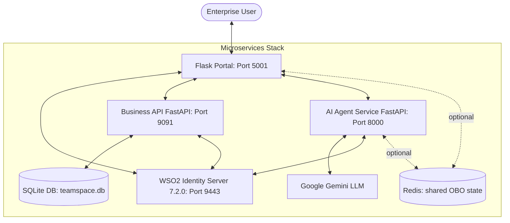
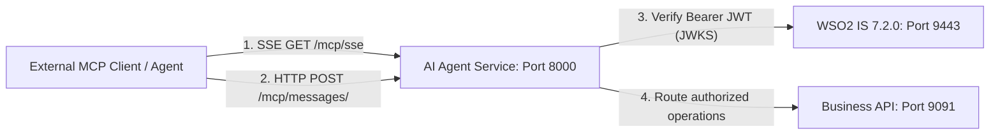

# Teamspace 🚀

[](https://github.com/vfraga/wso2-teamspace-demo/actions/workflows/ci.yml)

> **Enterprise B2B CIAM & Agentic AI Identity Demonstration Portal**
>
> A demonstration application highlighting **WSO2 Identity Server 7.2.0**'s advanced B2B CIAM (Customer Identity & Access Management) capabilities blended with **Agentic AI Identity (On-Behalf-Of Delegation)** workflows.

---

## 📖 Overview

**Teamspace** is a B2B collaboration and meeting management portal built for modern enterprise teams. It serves as a live demonstration blueprint targeting CTOs, enterprise architects, and identity professionals.

The application demonstrates two core paradigms in modern enterprise software:
1. **B2B CIAM**: Dynamic tenant/sub-organization onboarding, cross-organization application sharing, delegated administration, role management, federated login via an external Identity Provider, and personalized sub-tenant branding (via the WSO2 IS Branding Preference API).
2. **Agentic AI & Identity**: A smart assistant (**Worklink Assistant**) powered by **Google Gemini** that can act securely *on behalf of* users via the **OAuth 2.0 Token Exchange (RFC 8693)** protocol, verifying and executing authorized corporate tasks (e.g., booking meetings) without possessing long-lived static credentials or full-access master keys.

The portal UI is bilingual (English / Portuguese), switchable at runtime via the `/set_lang` route; translation strings live under `webapp/translations/`.

---

## 🏗️ Architecture & Component Topology

The system is designed as a set of decoupled services interacting with a central identity provider.



### 📦 Components

1. **`webapp/` (Flask User Portal — Port `5001`)**:
   - The primary B2B portal interface, built with Flask blueprints (`main`, `dashboard`, `admin`, `personalization`, `signup`, `subscription`, `chat`, `agents`) and vanilla CSS.
   - Leverages OpenID Connect (OIDC) via WSO2 IS (using Authlib) to handle user authentication, enterprise SSO, and permission checks.
   - Implements **Sub-Organization Branding Preferences**: reads and updates organization-specific styles (primary/secondary colors, logos, banners) dynamically using the WSO2 IS Organization Branding APIs.
   - Entry point: `webapp.app:create_app` (application factory).

2. **`api/` (FastAPI Business API — Port `9091`)**:
   - The core business backend. Persists meetings, agent configurations, and organization data via SQLAlchemy — SQLite (`teamspace.db`) by default, any SQLAlchemy URL via `DATABASE_URL` (the Postgres path is covered by its own CI job).
   - Schema is owned by **Alembic** (`migrations/`); `alembic upgrade head` applies it. Auto-creation on startup remains as a zero-config convenience outside production (`DB_AUTO_CREATE`).
   - Restricts operations using fine-grained OAuth 2.0 scopes (`list_meetings`, `create_meeting`, `update_meeting`, `delete_meeting`, etc.).
   - Validates JWT tokens issued by WSO2 IS, including checking for nested actor claims (`act`) in On-Behalf-Of scenarios.
   - Routers are mounted under `/meetings`, `/personalization`, `/agent-config`, and `/plans`. Entry point: `api.main:app`.

3. **`agent/` (AI Agent Service — Port `8000`)**:
   - The intelligent core utilizing the **Google Gemini API** (model `gemini-flash-latest`, via the `google-genai` SDK).
   - Acts as the **Worklink Assistant** which schedules and manages meetings on behalf of authorized corporate users.
   - Orchestrates the **OAuth 2.0 On-Behalf-Of (OBO) flow**: builds the WSO2 authorization URL, exchanges the returned authorization code for an OBO access token via RFC 8693 token exchange, and uses that delegated token to call the Business API.
   - Keeps per-thread OBO state (PKCE verifier, delegated tokens, chat history) behind a pluggable store (`agent/store.py`): in-process by default, Redis when `REDIS_URL` is set. This is what allows more than one agent instance — `/authorize` and `/callback` are different processes under gunicorn.
   - Also hosts the **MCP server** (see below). Entry point: `agent.main:app`.

4. **`common/` (Shared library)**:
   - Config defaults and one-shot `.env` loading (`config.py`), shared constants (`constants.py`), FastAPI error handlers (`fastapi_errors.py`), and credential masking plus the JWT claim summariser used in logs (`safe_auth_logger.py`).
   - `logging_setup.py` — the `LOG_LEVEL` resolution shared by all three services.
   - `jwt_validation.py` — the RS256/JWKS verification primitives. Deliberately one copy: the Business API, the MCP server and the M2M path all decode through it, so none can drift to weaker checks.
   - `m2m_auth.py` — OAuth 2.0 client-credentials tokens for service-to-service calls, both the client and the receiving FastAPI dependency.
   - `rate_limit.py` — shared limit configuration and the FastAPI enforcement dependency.

5. **Deployment**:
   - `Dockerfile` — one non-root image serving all three services; `docker-compose.yml` selects which per container and adds Redis.
   - `alembic.ini` / `migrations/` — the Business API's schema history.
   - `start.sh` / `stop.sh` — local process management; `SERVE_MODE=production` switches from the dev servers to gunicorn.

6. **`tests/` (Test Harness & E2E Suite)**:
   - A testing suite divided into `unit/`, `integration/`, and `e2e/` levels.
   - Features a **Programmatic Lifecycle Orchestrator** (`tests/conftest.py`) which manages ports, spins up dynamic, isolated clones of WSO2 IS inside a temporary folder, bootstraps the servers, configures credentials, and executes headless Playwright E2E flows before clean teardown.

---

## 🔒 The Agentic AI "On-Behalf-Of" (OBO) Flow

Traditional AI integrations require copying a static API key or granting the AI agent master administrator credentials. In high-security enterprise environments, this approach is unacceptable.

**Teamspace** implements the **RFC 8693 OAuth 2.0 Token Exchange** standard to establish narrow-scoped, time-bound, and fully auditable delegation:

```
┌──────┐             ┌──────────┐             ┌─────────────┐             ┌─────────┐
│ User │             │ AI Agent │             │  WSO2 IS    │             │ Biz API │
└──┬───┘             └────┬─────┘             └──────┬──────┘             └────┬────┘
   │                      │                          │                         │
   │ 1. "Schedule meeting"│                          │                         │
   ├─────────────────────>│                          │                         │
   │                      │ 2. Check OBO Token       │                         │
   │                      ├──┐                       │                         │
   │                      │  │ (None exists/expired) │                         │
   │                      │<─┘                       │                         │
   │ 3. Consent URL       │                          │                         │
   │<─────────────────────┤                          │                         │
   │                      │                          │                         │
   │ 4. Authenticate & Consent                       │                         │
   ├────────────────────────────────────────────────>│                         │
   │                      │                          │                         │
   │                      │ 5. Auth Code / User Token│                         │
   │                      │<─────────────────────────┤                         │
   │                      │                          │                         │
   │                      │ 6. Exchange for OBO Token│                         │
   │                      ├─────────────────────────>│                         │
   │                      │  (RFC 8693 token exchange)                         │
   │                      │                          │                         │
   │                      │ 7. OBO JWT Token Issued  │                         │
   │                      │<─────────────────────────┤                         │
   │                      │                          │                         │
   │                      │ 8. Create Meeting (with OBO Token)                 │
   │                      ├───────────────────────────────────────────────────>│
   │                      │                          │                         │ (Authorized!)
   │                      │                          │                         │<───────────
```

> [!IMPORTANT]
> The `state` parameter is a short-lived, HMAC-signed JWT paired with an `oauth_session`
> cookie, and **both are required** at the callback. They expire together after 5 minutes
> (`OAUTH_STATE_TTL_SECONDS`), which bounds authorization-code injection: a captured
> state is useless once it lapses, and useless without the matching cookie. The practical
> cost is that leaving the WSO2 consent screen open for more than five minutes means
> starting the authorization again.

### Decoded OBO Token Structure

The resulting OBO access token is a JSON Web Token (JWT) that asserts a dual-identity representation. This enables the Business API to verify both *who* the executing agent is, and *on whose behalf* it is performing the action:

```json
{
  "sub": "d54ac2dc-7cad-4842-bcce-7905da589f17", 
  "act": {
    "sub": "814889a0-7730-4928-a3b6-b3cfd776262f"
  },
  "aud": "fLHf61QVhvGKJwOhM3NvekepG1Aa",
  "aut": "APPLICATION_USER",
  "client_id": "fLHf61QVhvGKJwOhM3NvekepG1Aa",
  "iss": "https://localhost:9443/t/teamspace/oauth2/token",
  "org_handle": "numbainfinite",
  "org_id": "848d1d37-2bac-4fad-98bd-eed28bacf173",
  "scope": "create_meeting list_meetings openid profile",
  "exp": 1779330751
}
```

- **`sub`**: The User ID (the resource owner who delegated the authority).
- **`act`** (Actor Claim): The Agent ID (the SCIM agent client executing the request).
- **`org_handle`**: The B2B tenant organization domain identifier, ensuring strict data tenancy separation.

---

## 🛠️ Secure Model Context Protocol (MCP) Server Architecture

Teamspace incorporates a **Model Context Protocol (MCP)** server architecture to allow external clients (e.g., n8n, Cursor, Claude Desktop, or proprietary corporate agents) to securely consume the internal meeting tool suite. It is hosted by the AI Agent service (`agent/mcp_server.py`) and mounted on the FastAPI app at port `8000`.

Instead of deploying generic, unauthenticated MCP interfaces, Teamspace integrates **OAuth 2.1 zero-trust protection** directly into the protocol:



### 🔑 Security & Token Verification at the Protocol Level
* **Dynamic JWKS Validation**: Incoming MCP requests carry an `Authorization: Bearer <token>` header (or a `token` / `access_token` query parameter for clients that cannot set headers). The server verifies the token's signature dynamically against the WSO2 IS JWKS endpoint (`/oauth2/jwks`) using the RS256 algorithm.
* **Fine-Grained Scope Restrictions**: The MCP tools map directly to WSO2 registered scopes:
  * `list_meetings` requires `list_meetings_agent` or `list_meetings` scope.
  * `schedule_meeting_preview` / `schedule_meeting` require `create_meeting_agent` or `create_meeting` scope.
  * `update_meeting_preview` / `update_meeting` require `update_meeting_agent` or `update_meeting` scope.
  * `delete_meeting_preview` / `delete_meeting` require `delete_meeting_agent` or `delete_meeting` scope.
  * Note: the *finalizing* tools (`schedule_meeting`, `update_meeting`, `delete_meeting`) require the `_agent` (OBO-delegated) scope specifically — the plain user scope is not sufficient.
* **Context-Bound Multi-Tenant Operations**: To guarantee multi-tenant safety across asynchronous operations, the active OAuth token is isolated per request/task using a `ContextVar` (`mcp_token_ctx`) during tool callback dispatches.

### 🔌 Mounted Protocol Endpoints
1. **`GET /mcp/sse`**: Establishes a persistent Server-Sent Events (SSE) channel and announces the JSON-RPC message endpoint.
2. **`POST /mcp/messages/`**: Handles protocol messages (JSON-RPC 2.0 requests) containing tool listings or tool execution commands.

### 🧰 Exposed MCP Tools
`list_meetings`, `schedule_meeting_preview`, `schedule_meeting`, `update_meeting_preview`, `update_meeting`, `delete_meeting_preview`, `delete_meeting`.

---

## ⚙️ Configuration & Environment

The application leverages a single `.env` file read by all three services (via `common/config.py`). Copy the template to start:

```bash
cp .env.example .env
```

> [!NOTE]
> The values in `.env.example` are placeholders. At minimum you must fill in `CLIENT_ID`, `CLIENT_SECRET`, and `APP_ID` (generated by `setup_is.py`), `GEMINI_API_KEY`, and the WSO2 admin passwords used by the setup scripts (`IS_SUPER_ADMIN_PASSWORD`, `IS_TENANT_ADMIN_PASSWORD`). Service-to-service auth needs no additional secrets — see *Service-to-Service (M2M) Auth* below.

### Environment Variables

**WSO2 Identity Server**

| Variable | Description | Default |
| :--- | :--- | :--- |
| `IS_BASE_URL` | Root URL where WSO2 Identity Server is running. | `https://localhost:9443` |
| `IS_ORG_HANDLE` | Root B2B tenant handle. Set to `teamspace` for tenant mode; leave empty for `carbon.super`. | *(empty)* |
| `IS_VERIFY_TLS` | Whether to verify the IS TLS certificate. Set `false` for local dev with self-signed certs. Applies to **every** outbound call to WSO2 IS, including OIDC discovery, the token endpoint and the JWKS fetch. | `true` |
| `WSO2_IS_TEMPLATE_PATH` | Path to a clean, un-bootstrapped WSO2 IS 7.2.0 install. Required **only** for live E2E tests (used for dynamic server cloning). | `/path/to/wso2is-7.2.0.24` |

**OAuth2 Application** (generated by `setup_is.py`)

| Variable | Description | Default |
| :--- | :--- | :--- |
| `CLIENT_ID` | Main OAuth2 Client ID for the Teamspace portal. | *(empty — from bootstrap)* |
| `CLIENT_SECRET` | OAuth2 Client Secret for the Teamspace portal. | *(empty — from bootstrap)* |
| `APP_ID` | Application ID of the registered Teamspace app in WSO2 IS. | *(empty — from bootstrap)* |
| `APP_NAME` | Registered name of the enterprise portal application. | `Teamspace` |

**Plan Gating on Enterprise Features**

The Identity Provider, Login Flow and AI Agents admin pages are gated on the org's
**plan** and the user's **role** — both, with the plan checked first
(`webapp/blueprints/admin.py:check_idp_access`, `webapp/blueprints/agents.py:_check_plan_and_role`).

The role alone is not a safe proxy for the plan: `PLAN_ROLES` grants `idp-manager` and
the branding-editor roles when an org upgrades (`webapp/blueprints/subscription.py`), but
that handler never *revokes* them and accepts a downgrade — so an org that drops from
enterprise to basic keeps every role its old plan granted.

Because the plan lookup can fail, the gate is a three-way decision:

| Plan lookup | Role held | Outcome |
| :--- | :--- | :--- |
| says the org isn't entitled | either | upgrade prompt |
| says the org is entitled | yes | allowed |
| says the org is entitled | no | "you need this role" (not a misleading upgrade prompt) |
| unknown (Business API unreachable) | yes | allowed — an outage must not revoke paid features |
| unknown | no | upgrade prompt |

`resolve_plan_for_gating` (`webapp/api_proxy.py`) is what distinguishes "this org has no
subscription" (HTTP 404 — signup always writes a plan row) from "the Business API is
unreachable" (5xx). `get_organization_plan` reports both as `basic` and is therefore for
display only, never for an access decision.

**Serving & Deployment**

| Variable | Description | Default |
| :--- | :--- | :--- |
| `SERVE_MODE` | `production` makes `start.sh` serve all three services behind gunicorn. Anything else keeps the Flask/uvicorn dev servers. | `development` |
| `API_WORKERS` / `AGENT_WORKERS` / `WEBAPP_WORKERS` | Gunicorn worker counts in production mode. | `4` each |
| `DB_AUTO_CREATE` | Whether the Business API creates missing tables at startup. Defaults on outside production so the demo boots against an empty DB; off when `FLASK_ENV=production`, where Alembic owns the schema. | *(see description)* |

> [!IMPORTANT]
> With `SERVE_MODE=production`, `start.sh` **refuses to start** if `AGENT_WORKERS` is
> above 1 while `REDIS_URL` is unset. The agent's OBO state would not be shared between
> workers, so `/authorize` and `/callback` could land on different processes and the
> consent flow would fail intermittently — a failure worth catching at boot rather than
> mid-demo.

**Rate Limiting**

| Variable | Description | Default |
| :--- | :--- | :--- |
| `RATE_LIMIT_ENABLED` | Set `false` to disable rate limiting entirely. | `true` |
| `RATE_LIMIT_CHAT` | Limit on the chat endpoints — the ones that reach Gemini. | `60/minute` |
| `RATE_LIMIT_AUTH` | Limit on the agent's `/authorize` and `/callback`. | `120/minute` |
| `RATE_LIMIT_DEFAULT` | Global backstop on the remaining endpoints. | `600/minute` |
| `RATE_LIMIT_TRUST_FORWARDED_FOR` | Key limits on the first `X-Forwarded-For` hop instead of the peer address. Enable **only** behind a proxy you control — `docker-compose.yml` sets it, because Docker's NAT would otherwise put every client in one bucket. | `false` |
| `MAX_MCP_SSE_STREAMS` | Ceiling on simultaneously-open MCP SSE streams on the agent. Each connection is held for its lifetime, so this bounds worker exhaustion. | `32` |

Storage follows `REDIS_URL`: in-process counters without it (so limits are per worker),
shared counters with it. The defaults are set well above any demo walkthrough so clicking
through the OBO flow repeatedly never trips them.

> [!NOTE]
> On the FastAPI services the limits are **dependencies ordered ahead of
> `require_service_auth`**, not decorators on the handler. FastAPI resolves a route's
> dependencies before calling its handler, so a decorator-based limit would only ever
> count requests that had already authenticated — leaving an unauthenticated flood
> unthrottled. `common/rate_limit.py` explains this; `tests/integration/test_rate_limiting.py`
> guards the ordering.

**Agent State Store**

| Variable | Description | Default |
| :--- | :--- | :--- |
| `REDIS_URL` | Redis connection string for the agent's shared state. Unset means an in-process store — fine for the demo, but the agent then cannot run more than one instance. | *(unset — in-memory)* |
| `REDIS_KEY_PREFIX` | Prefix for the agent's Redis keys, if you share a Redis with other applications. | *(empty)* |

The agent keeps per-thread OBO state behind a pluggable store (`agent/store.py`).
`InMemoryStore` is the default so the demo needs no extra infrastructure. Setting
`REDIS_URL` switches to `RedisStore`, which is what lets `/authorize` and `/callback`
run on different workers — the PKCE verifier, the OBO tokens and the chat history all
become visible to every instance. Install the extra with `uv sync --extra redis`.

> [!WARNING]
> With `RedisStore`, **OBO access tokens and per-org agent credentials are at rest in
> Redis**. Require AUTH and TLS on the connection and keep the TTL short
> (`agent/store.py:DEFAULT_TTL_SECONDS`, 24h by default). A bad or unreachable
> `REDIS_URL` logs an error and falls back to in-memory rather than refusing to boot —
> check the startup line `Agent state store: ...` to confirm which backend is live.

**Observability** (all three services)

| Variable | Description | Default |
| :--- | :--- | :--- |
| `LOG_LEVEL` | Root log level for every service (`DEBUG`/`INFO`/`WARNING`/`ERROR`/`CRITICAL`). An explicit value always wins. | `DEBUG`, or `INFO` when `FLASK_ENV=production` |

> [!NOTE]
> **`DEBUG` is the intentional default.** Teamspace exists to let you watch the identity
> workflow happen — token exchange, OBO state transitions, claim contents — so the local
> demo stays verbose. Setting `FLASK_ENV=production` drops it to `INFO` without needing
> `LOG_LEVEL`. Resolution lives in `common/logging_setup.py`.
>
> Token claims are logged as a masked one-line summary (`common/safe_auth_logger.py:format_claims`):
> `sub`/`org`/`aut`/`scope`/`act.sub` stay legible because they are what the demo teaches;
> the raw token, the full payload, and plaintext emails are never written. User chat
> message content is `DEBUG`-only, so it is visible in the demo and absent in production.

**Flask Web Portal**

| Variable | Description | Default |
| :--- | :--- | :--- |
| `FLASK_SECRET_KEY` | Secret used to sign session cookies. If unset, an ephemeral key is generated (sessions lost on restart). | *(generated, with warning)* |
| `FLASK_HOST` | Host the Flask portal binds to. | `localhost` |
| `FLASK_PORT` | Port the Flask portal binds to. | `5001` |
| `FLASK_DEBUG` | Standard Flask flag enabling debug mode / reloader when running `flask run`. | `true` (in `.env.example`) |
| `FLASK_ENV` | When set to `production`, enables secure session cookies and a Content-Security-Policy header. | *(unset)* |

**Business API & AI Agent**

| Variable | Description | Default |
| :--- | :--- | :--- |
| `BUSINESS_API_URL` | URL where the Business API is hosted. | `http://localhost:9091` |
| `AGENT_SERVICE_URL` | URL where the AI Agent Service is hosted. | `http://localhost:8000` |
| `AGENT_REDIRECT_URI` | OAuth2 redirect callback for the AI Agent OBO flow. | `http://localhost:8000/callback` |
| `GEMINI_API_KEY` | Google Gemini API key powering the Worklink Assistant. | *(empty)* |
| `DATABASE_URL` | SQLAlchemy connection string for the Business API. | `sqlite:///teamspace.db` |
| `ALLOWED_ORIGINS` | Comma-separated CORS allow-list for the FastAPI services. | `http://localhost:5001` |
| `MOCK_LLM` | When `true`, the agent runs without calling Gemini (used by tests). | `false` |

**Service-to-Service (M2M) Auth** — no shared secret to configure

The three services authenticate to each other with **OAuth 2.0 client-credentials
tokens** minted from the `CLIENT_ID` / `CLIENT_SECRET` above and presented in the
`X-Service-Authorization` header:

| Hop | Endpoints |
| :--- | :--- |
| webapp → agent | `/chat`, `/chat/stream`, `/state/{thread_id}`, `/agent-token`, `/clear/{thread_id}` |
| webapp → Business API | agent-config lookup backing the chat panel |
| agent → Business API | the agent reading its own organization's config |

The receiver verifies the token exactly as it verifies a user token — RS256 pinned
against WSO2 IS's JWKS, with audience, issuer and expiry enforced (`common/jwt_validation.py`)
— and then requires the **`internal_service`** scope (`common/m2m_auth.py`).

`Authorization` is deliberately left for the *end-user* JWT. The Business API's
`GET /agent-config/org/{org_id}` wants both principals at once: the service as the
trust gate, the user for the audit line. Separate headers keep them distinct with no
precedence rules to get wrong, and the same shape works on the webapp→agent hop where
no user token is sent at all.

> [!IMPORTANT]
> `setup_is.py` provisions `internal_service` on a **Teamspace Internal Services**
> API resource (`urn:teamspace:internal`) authorized with **`policyIdentifier: NO_POLICY`**.
> This is not optional. WSO2 grants RBAC-policy scopes through a user's roles, and a
> client-credentials token has no user — so under RBAC the token comes back valid but
> with an **empty `scope` claim**, and every M2M call 403s. `ServiceTokenClient` detects
> this case and logs the likely cause rather than passing on a useless token. If you
> bootstrapped an instance before this change, **re-run `setup_is.py`**.

> [!NOTE]
> Because `internal_service` is granted to the *application* and to no user role, a
> user-bearing token can never carry it. The scope is therefore the hard gate; the
> `aut=APPLICATION` claim is checked as defence-in-depth, and only when present, so a
> WSO2 build that omits it doesn't break every M2M call.

This replaced a static `X-Internal-Secret` shared secret spread across three env vars
(`AGENT_INTERNAL_SECRET`, `INTERNAL_SECRET`, `BUSINESS_API_INTERNAL_SECRET`). **None of
them are read any more** — delete them from an existing `.env`. That scheme had no
expiry, no per-call scoping and no caller identity: anyone who obtained the value gained
full trusted-service access, including the ability to start an OBO flow for an arbitrary
user. Service tokens are short-lived, scoped, and verifiable.

**Agent OAuth State Signing**

| Variable | Description | Default |
| :--- | :--- | :--- |
| `AGENT_STATE_SIGNING_SECRET` | HMAC key for the `state` JWT in the agent's OBO flow. Must be **stable and shared** across every agent instance — `/authorize` signs it and `/callback` verifies it, which are different processes once more than one worker runs. | falls back to `CLIENT_SECRET` |

> [!WARNING]
> This key is **never auto-generated**. A random value would verify only on the instance
> that signed it, silently breaking the OBO callback under scaling — which is exactly what
> the previous `AGENT_INTERNAL_SECRET` fallback did. If neither this variable nor
> `CLIENT_SECRET` is set, the agent refuses to start when `FLASK_ENV=production`, and
> `/authorize` returns a handled error page otherwise.

**Federated Identity Provider** (optional — for the external-IdP / SSO demo)

| Variable | Description | Default |
| :--- | :--- | :--- |
| `FEDERATED_IDP_URL` | SCIM2 Users endpoint of the federated IdP instance. | `https://localhost:9444/t/worklink.com/scim2/Users` |
| `FEDERATED_IDP_ADMIN_USER` | Admin username for the federated IdP. | `teamspaceadmin@worklink.com` |
| `FEDERATED_IDP_ADMIN_PASSWORD` | Admin password for the federated IdP. | *(empty)* |

**Branding defaults**

| Variable | Description | Default |
| :--- | :--- | :--- |
| `DEFAULT_LOGO_URL` | Default logo used when an org has no custom branding. | jsDelivr CDN SVG |
| `DEFAULT_FAVICON_URL` | Default favicon used when an org has no custom branding. | jsDelivr CDN SVG |

**Setup-script credentials** (consumed by `setup_is.py`, `setup_idp_server.py`, `setup_secondary_is.py`)

| Variable | Description | Default |
| :--- | :--- | :--- |
| `IS_SUPER_ADMIN_USERNAME` | WSO2 IS super-admin username. | `admin` |
| `IS_SUPER_ADMIN_PASSWORD` | WSO2 IS super-admin password. Required, or IS API calls fail with 401. | *(empty)* |
| `IS_TENANT_ADMIN_PASSWORD` | Password set for the bootstrapped `teamspaceadmin` tenant admin (this is the portal login password). | *(empty)* |
| `FEDERATED_USER_PASSWORD` | Password for the federated IdP's seeded test users. | *(empty)* |

> [!IMPORTANT]
> **Strict B2B Tenant & Agent Isolation**:
> Global `AGENT_ID` and `AGENT_SECRET` environment variables are **intentionally not supported**. Hardcoding a single root-level agent that crosses tenant domains represents a severe security boundary violation.
>
> Instead, Teamspace enforces absolute B2B tenant isolation:
> 1. Each sub-organization (tenant) administrator dynamically provisions their own SCIM2 Agent via the portal's **AI Agents** admin interface.
> 2. The dynamic credentials (`agent_id` and `agent_secret`) returned by WSO2 IS are persisted in the organization's database configuration.
> 3. During chat interactions, the portal dynamically retrieves the active tenant's agent credentials and injects them into the AI Agent service payload, ensuring token exchange is strictly contained within correct organizational boundaries.

---

## 🚀 Step-by-Step Installation & Quickstart

Follow these steps to run the complete microservices stack locally against your WSO2 Identity Server instance.

### Prerequisites

- **Python 3.10+** (Recommended: Python 3.11 or 3.12).
- **WSO2 Identity Server 7.2.0** installed and running locally on `https://localhost:9443`.
- **Google Gemini API Key** (from [Google AI Studio](https://aistudio.google.com/)).
- **macOS or Linux** (the start/stop scripts and test orchestrator target Unix shells).

---

### Step 1: Install Dependencies

The project is defined entirely by `pyproject.toml` (with a pinned `uv.lock`). There is no `requirements.txt`.

Using [`uv`](https://docs.astral.sh/uv/) (recommended — a fast Python package installer and resolver):
```bash
# Create a virtual environment and install from the lockfile
uv venv
uv sync

# To include test/dev tooling (pytest, ruff, playwright):
uv sync --extra dev
```

Or using standard `venv` + `pip`:
```bash
python3 -m venv .venv
source .venv/bin/activate
pip install -e .            # runtime dependencies
pip install -e ".[dev]"     # optional: test/lint tooling
```

If you plan to run the live E2E tests, also install the Playwright browser(s):
```bash
.venv/bin/playwright install chromium
```

---

### Step 2: Bootstrap WSO2 Identity Server

Ensure WSO2 IS is running on `https://localhost:9443`, then set the admin passwords the script needs (in `.env` or your shell) and run the automated bootstrap:

```bash
# Required by setup_is.py:
#   IS_SUPER_ADMIN_PASSWORD   (WSO2 super-admin, default user is "admin")
#   IS_TENANT_ADMIN_PASSWORD  (becomes the teamspaceadmin portal login password)
python setup_is.py
```

The script is **idempotent** (safe to re-run). It creates the `teamspace` tenant, sets branding, registers the B2B SaaS application, and configures API resources, scopes, and roles. On success it prints the generated credentials — **copy these into your `.env` file**:

- `CLIENT_ID`
- `CLIENT_SECRET`
- `APP_ID`

> **Optional — Federated login demo:** To demonstrate login through an external IdP, run `python setup_secondary_is.py`. It clones a second WSO2 IS to run on port `9444`, starts it, and bootstraps the `worklink.com` federated IdP (tenant, application, groups, test users). The lower-level `setup_idp_server.py` bootstraps an already-running 9444 instance and is what the live E2E harness invokes.

---

### Step 3: Run the Microservices Stack

Launch all three services (Flask Web App, Business API, AI Agent Service) using the unified start script:

```bash
bash start.sh
```

The script starts the Business API and AI Agent under `uvicorn`, waits for each `/health` endpoint, then starts the Flask portal. Set `DEV_MODE=true` to enable hot-reload (`--reload` for the FastAPI services, `--debug` for Flask):

```bash
DEV_MODE=true bash start.sh
```

You should see all three services live:
* **Web App (Flask Portal)**: `http://localhost:5001`
* **Business API (FastAPI)**: `http://localhost:9091`
* **AI Agent (FastAPI)**: `http://localhost:8000`

#### Serving behind gunicorn

`SERVE_MODE=production` swaps the development servers for gunicorn (with uvicorn workers
for the two FastAPI services). Pair it with `REDIS_URL` so the agent can run more than
one worker:

```bash
SERVE_MODE=production REDIS_URL=redis://localhost:6379/0 bash start.sh
```

Without `REDIS_URL` the script refuses to start a multi-worker agent, because the OBO
consent callback would land on workers that never saw `/authorize`. Set
`AGENT_WORKERS=1` if you want production serving on a single agent instance.

#### Running in containers

`docker-compose.yml` brings up the three services plus Redis, all in production mode:

```bash
docker compose run --rm business-api alembic upgrade head   # first time only
docker compose up --build
```

WSO2 IS is deliberately **not** containerised — it is provisioned out-of-band by
`setup_is.py` against an install you control, so compose consumes it via `IS_BASE_URL`
(defaulting to `https://host.docker.internal:9443` for a WSO2 IS running on the host).

---

### Step 4: Access the Portal

1. Open your browser at `http://localhost:5001`.
2. Login using the bootstrapped administrator:
   - **Username**: `teamspaceadmin@teamspace`
   - **Password**: the value you set for `IS_TENANT_ADMIN_PASSWORD`.
3. Explore B2B features:
   - Onboard a sub-organization (e.g. `numbainfinite` or `nuvora`).
   - Create enterprise users inside those sub-organizations.
   - Navigate to **Branding Preferences** and customize the logo, background image, primary color, and typography of your sub-organization portal — the theme updates in real time.

---

### Step 5: Test the AI Agent Flow

1. From the portal, open the **Worklink Assistant** (AI Agent).
2. Register an Agent inside your sub-organization (via **Admin → AI Agents**) to provision its `agent_id` / `agent_secret`, if not already done.
3. Type in the chat interface:
   > *"Schedule a meeting for tomorrow at 2 PM with the topic 'Security Review'."*
4. The agent analyzes the request, determines it needs delegation permissions, and replies with an **Authorize Meeting Booking** link.
5. Click the link, consent to the meeting-booking delegation on the WSO2 IS page, and return to the assistant.
6. The assistant detects the callback, exchanges the token, and schedules the meeting.

---

### Step 6: Shutdown

To cleanly terminate all running services, press `Ctrl+C` in the terminal running `start.sh`, or from another terminal:

```bash
bash stop.sh
```

`stop.sh` kills the processes recorded in `/tmp/teamspace_*.pid` and sweeps up any stragglers matching the uvicorn/flask commands.

---

## 🧪 Testing Suite

Test dependencies live in the `dev` (and `test`) optional-dependency groups. The project is configured (in `pyproject.toml`) with `pythonpath = ["."]` and `testpaths = ["tests"]`, and registers a `live` marker for E2E tests.

### 1. Unit & Integration Tests (Offline)

These run completely offline and do not require WSO2 IS to be active. They validate schemas, database helpers, JWT parsing and verification, scope enforcement, masking, and helper logic — plus the M2M service-token exchange (end to end against a WSO2-shaped token endpoint on a loopback port), the agent state store against both backends, OBO state/CSRF handling, rate-limit enforcement, plan gating, `id_token` verification, and log-level resolution:

```bash
.venv/bin/pytest tests/unit/ -v
.venv/bin/pytest tests/integration/ -v
```

### 2. Live E2E Playwright Tests (Isolated)

These execute Playwright scenarios against dynamically managed, clean WSO2 Identity Server instances. They require `WSO2_IS_TEMPLATE_PATH` to point at a fresh WSO2 IS 7.2.0 install and Playwright browsers to be installed:

```bash
# Point at your clean WSO2 IS template directory (if not already in .env)
export WSO2_IS_TEMPLATE_PATH="/path/to/wso2is-7.2.0.24"

# Run the full suite
.venv/bin/pytest tests/ -v
```

If `WSO2_IS_TEMPLATE_PATH` is unset, the live E2E fixture is **skipped** automatically; the offline unit/integration tests still run.

#### 🛡️ How the Programmatic Orchestrator Works (`tests/conftest.py`):
1. **Port Hygiene**: Before launching, it kills any residual processes on ports `9443`, `9444`, `5001`, `9091`, and `8000` to prevent socket conflicts.
2. **Dual Cloning**: It copies the template at `WSO2_IS_TEMPLATE_PATH` into a temporary folder *twice* — a primary instance (port `9443`) and a federated-IdP instance (port `9444`, via `offset = 1` in `deployment.toml`). On macOS APFS, `cp -R` uses fast copy-on-write clones.
3. **Boot & Poll**: It spawns each WSO2 IS in its own process group (`os.setsid`) and polls the `/api/server/v1/tenants` endpoint until both return HTTP `200`.
4. **Bootstrap & Capture**: It runs `setup_is.py` (capturing stdout to parse the generated `CLIENT_ID`, `CLIENT_SECRET`, `APP_ID`) and `setup_idp_server.py` for the federated IdP.
5. **Microservices Injection**: It launches all three microservices with the freshly parsed credentials, isolating the DB as `test_live_teamspace.db` and forcing `MOCK_LLM=true` so no real Gemini calls are made.
6. **E2E Playwright Run**: It executes the browser-driven test paths (including the full agent consent and token-exchange flow).
7. **Clean Teardown**: On completion or failure, it kills all subprocess groups, prints captured server/service logs for debugging, removes the temporary databases, and deletes the temporary WSO2 clones.

### Linting

Ruff is configured (in `pyproject.toml`) with a narrow, correctness-focused rule set:

```bash
ruff check .
```

### Continuous Integration

`.github/workflows/ci.yml` runs on every push and pull request against `main`: `ruff check .`; a security job (`pip-audit` over the locked runtime dependencies, `bandit` at medium severity and above); the integration suite against a real **Postgres** service container with migrations applied; then the unit and integration suites (327 tests) on Python 3.10 and 3.12. Both are hermetic — no WSO2 IS, no Gemini key, no browser. Dependencies are installed from the lockfile with `uv sync --frozen --extra dev`.

The browser-driven suite lives in `.github/workflows/e2e.yml` and now also runs on every push and pull request against `main`. It executes the mocked Playwright scenarios (`tests/e2e/test_e2e_mocked.py`), which are self-contained — a mock WSO2 IS alongside the real Business API, AI Agent and Flask portal on loopback ports — and **all eight cases pass**. It stays a separate workflow from `ci.yml` because it installs a browser and boots four servers; the header comment there records the three bugs that used to make it red. The `live` tests stay out of CI entirely — a hosted runner has no WSO2 IS install to clone.

---

## 💡 Production Deployment Considerations

When moving from a local demo stack to a production environment:

1. **SSL/TLS Certificates**: For local dev the services disable TLS verification (`IS_VERIFY_TLS=false`) to accommodate WSO2's default self-signed localhost cert. In production, install valid CA-signed certificates, set `IS_VERIFY_TLS=true`, and terminate TLS in front of the stack — gunicorn is not exposed directly.
2. **Database Migration**: The Business API uses SQLite (`teamspace.db`) by default. Point `DATABASE_URL` at a highly available PostgreSQL or MySQL instance for production. Schema is managed by Alembic — run `alembic upgrade head` before serving. An existing database created by the old `Base.metadata.create_all` path should be adopted with `alembic stamp head` first, so the baseline is not replayed over live tables.
3. **Session Store**: Set `REDIS_URL` and Flask sessions move from the local file system (`flask_session/`, via `cachelib`) to Redis. The same variable switches the agent's OBO state store and the rate-limit counters, so one setting makes the whole stack multi-instance capable.
4. **Credential Rotation**: Never commit `.env`. Store `GEMINI_API_KEY`, `CLIENT_SECRET`, `AGENT_STATE_SIGNING_SECRET`, and any agent secrets in a secrets manager (e.g. AWS Secrets Manager, HashiCorp Vault) and inject them as environment variables.
5. **Service-to-Service Auth**: M2M calls use short-lived OAuth 2.0 client-credentials tokens issued by WSO2 IS and verified against JWKS — no shared secret. Ensure the `internal_service` API resource is authorized with `NO_POLICY` (`setup_is.py` does this) and that all hops run over TLS. See *Service-to-Service (M2M) Auth* in the *Configuration & Environment* section above. Consider adding mTLS between services as a second layer.
6. **Production Flag**: Set `FLASK_ENV=production` to enable secure session cookies, the Content-Security-Policy response header, an `INFO` default log level (see `LOG_LEVEL` under *Observability*), and Alembic-owned schema (`DB_AUTO_CREATE` off). The agent additionally refuses to start if it has no stable OAuth state-signing key.
7. **Serving**: Set `SERVE_MODE=production` so `start.sh` runs gunicorn (with uvicorn workers for the two FastAPI services) instead of the development servers, or use the provided `docker-compose.yml`, which does this for you.

---

## ⚠️ Known Issues & Production-Readiness Gaps

Teamspace is a **demonstration app**, but it is no longer single-instance demo-grade.
Its identity fundamentals are sound — JWTs are validated correctly (RS256 pinned,
signature-against-JWKS, audience + issuer + expiry enforced via
`common/jwt_validation.py`), the portal verifies the OIDC `id_token` including a
per-login nonce, service-to-service calls use short-lived OAuth 2.0 client-credentials
tokens, the OBO flow is CSRF-protected, and errors don't leak stack traces. With
`REDIS_URL` and `SERVE_MODE=production` it runs multi-worker behind gunicorn, with a
migrated schema and rate-limited endpoints.

The following are the gaps that remain.

### Blockers

*None outstanding.* The five that were listed here — development servers, in-process
agent state, hardcoded DEBUG logging with a decoded-JWT dump, the random M2M secret
fallback, and the static shared-secret M2M scheme — have all been addressed. TLS
termination is still the deployer's responsibility (see *Production Deployment
Considerations*).


### Medium

- **Rate limiting is per-instance unless Redis is configured.** With `REDIS_URL` the
  counters are shared; without it each gunicorn worker keeps its own, so the effective
  limit is roughly `workers x limit`. In front of a real deployment, a WAF/LB/gateway is
  usually the better place for this anyway — the in-app limits are a backstop.
- **The MCP bearer token may be passed as a query parameter.** `?token=` exists because
  browser `EventSource` cannot set an `Authorization` header. Query strings land in
  access logs, browser history and `Referer`. Gunicorn's access log is off by default in
  both `start.sh` and compose — leave it that way, or filter those parameters if you
  enable it.

### Low / polish

- The Ruff rule set is intentionally narrow — correctness rules only, no type checking
  (mypy). Security scanning is no longer missing: `ci.yml` runs `pip-audit` against the
  locked runtime dependencies and `bandit` at medium severity and above.
- The portal's session `user_scopes` gate the UI only. They now come from a verified
  access token, but authorization is still enforced server-side by the Business API and
  the agent — treat the UI state as a hint, never as a boundary.

---

## 📄 License & Credits

Built by Vinicius Fraga. Powered by WSO2 Identity Server and Google Gemini.

Released under the **Apache License 2.0** — see [`LICENSE`](./LICENSE). All third-party
runtime dependencies are distributed under permissive licenses (BSD-3-Clause, MIT, or
Apache-2.0), which are compatible with this license.
